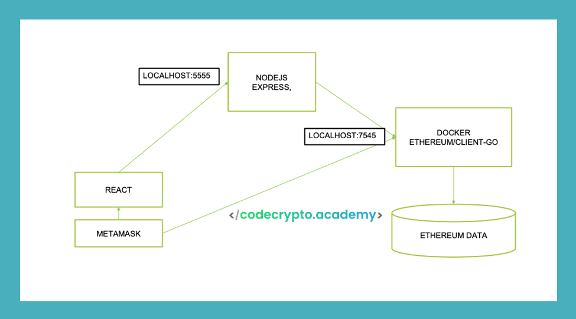

#  Ethereum Faucet Project

## Overview

This project is a part of the curriculum for the "FromWeb2toWeb3 Blockchain Eng. Master" course offered by [CodeCrypto Academy](https://codecrypto.academy/).

This repository contains instructions and code for setting up a faucet for a private Ethereum network. The faucet allows users to request and receive Ether (ETH) for testing and development purposes.

### App Architecture

The architecture of the app is given by codecrypto.academy,  see the scheme below:

<figure><figcaption><p>App Architecture, source: cedecrypto.academy</p></figcaption></figure>

*Node Express is exposed on port 3000
### Prerequisites

Before you begin, ensure you have the following prerequisites installed:

1. **Docker**: Install Docker to set up a local Ethereum node with the desired network configuration.
2. **Metamask**: Ensure you have Metamask installed in your browser and configure it to connect to the Ethereum private network.

## Steps

### 1. Faucet Node

Run Docker Desktop

Open your Metamask

**Set YOUR wallet direction in nodo/genesis.json and Save It**
### ethereum/client-go version 1.11.5

In terminal:


```
cd faucet-node/node

docker run --rm -it -v ${PWD}/data/keystore:/data ethereum/client-go:v1.11.5 account new --keystore /data
// Set password: 1234 (if you prefer another, remember change it also in Back module)

docker run -d -p 8545:8545 -p:30303:30303 -v ${PWD}/data:/data -v ${PWD}/genesis.json:/genesis.json --name eth-node  ethereum/client-go:v1.11.5 init --datadir data /genesis.json
```

```
// Set  your metamask to see the first results and if it works

docker run -d -p 8545:8545 -p:30303:30303 -v ${PWD}/data:/data --name eth-node-8888  ethereum/client-go:v1.11.5 \
--datadir data --http.api personal,admin,eth,net,web3 --http.corsdomain="*" --http --http.addr 0.0.0.0 \
--http.port 8545 --mine --miner.etherbase <<YOUR_WALLET>> --miner.threads=1
```

**Reset web explorer and Metamask**

**Set the NEW wallet direction in nodo/genesis.json and Save It**

The new account will be the Faucet miner

Rename the file created (UTC--... for account.json) and take the new wallet address (add an 0x where you paste it (genesis and comand))

### 2. Faucet Back

```
cd ..
cd back
yarn init -y
yarn add web3
yarn add express
yarn add cors
npx nodemon app.js
```

```
//new terminal 
// Destiny address of the funds from faucet account
curl localhost:3000/faucet/<<Your 0x Wallet Account >>

//Refresh the cache in metamask or the entire explorer to see the balance of the new account, could take a minutes
curl localhost:3000/balance/<<Your 0x Wallet Account >>
```

### 3. Faucet Front

```
yarn create vite faucet-front --template react
cd ..
cd faucet-front
yarn
yarn dev
```

